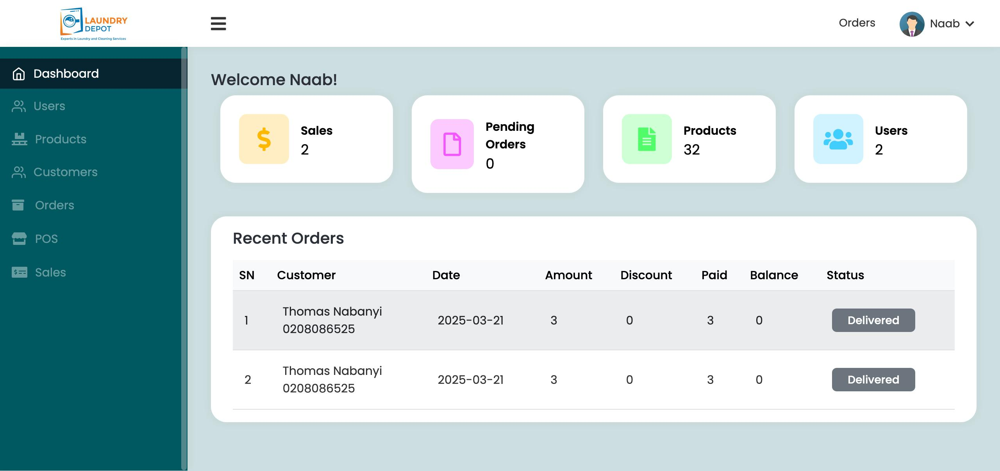
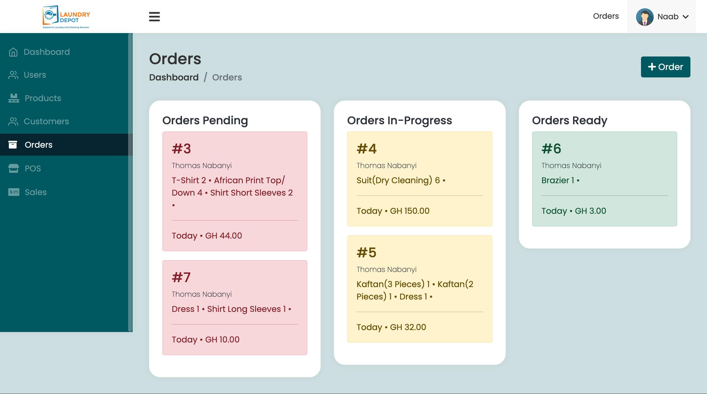
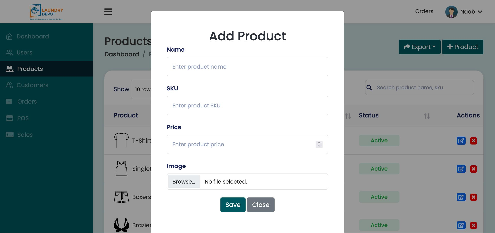
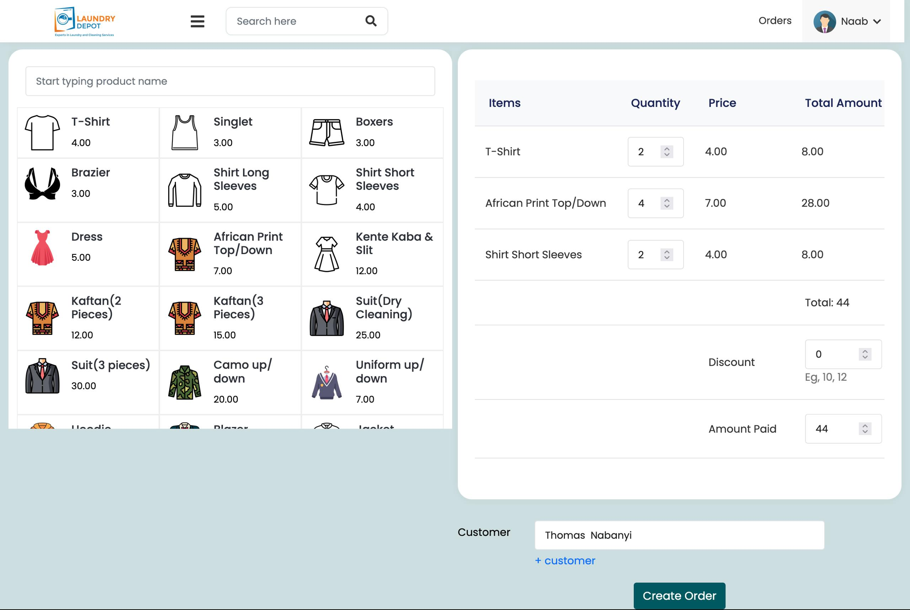
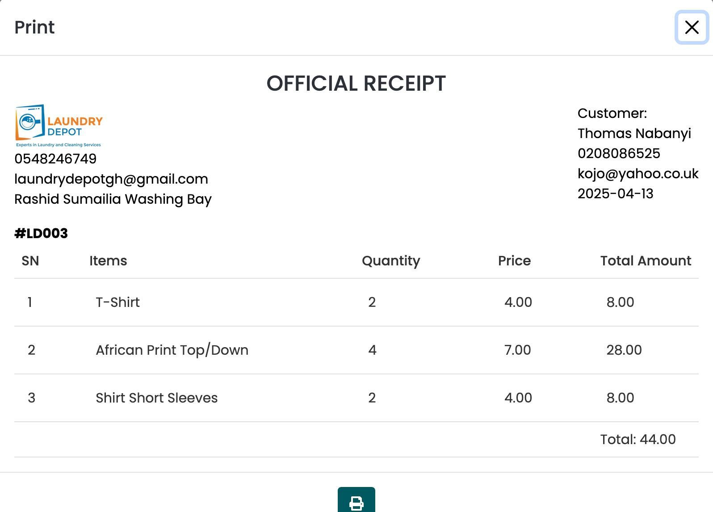

```markdown
# Laundry POS - PHP Point of Sale System for Laundry Businesses

Laundry POS is a lightweight and intuitive PHP-based Point of Sale system built specifically for small to medium-sized laundry businesses. Developed as a custom solution for a real laundry shop, it covers all core operations like customer management, order tracking, payments, and service offerings.

## 🚀 Features

- **User & Role Management**
  - Add multiple users with customizable role-based access control.

- **Service/Product Management**
  - Add and manage laundry services or products (e.g. Washing, Ironing, Dry Cleaning).

- **Order Management**
  - Receive orders with real-time tracking across different statuses:
    - Pending
    - In-Progress
    - Delivered

- **Payment Tracking**
  - Categorize and view orders based on payment status:
    - Paid
    - Partially Paid
    - Unpaid

- **Customer Management**
  - Maintain a customer database to monitor order history and contact information.

- **Intuitive POS Interface**
  - Fast and responsive UI designed for quick in-shop usage.
  - Apply discounts, create new customers on the go, and generate receipts.

## 🛠️ Tech Stack

- PHP (Core)
- MySQL (Database)
- Bootstrap (Frontend UI)
- jQuery (Interactivity)

## 📸 Screenshots

> Add screenshots of key features here (POS interface, order wall, customer view, etc.)

## 📦 Installation

1. **Clone the repository**
   ```bash
   git clone https://github.com/Nabanyi/laundry-pos.git
   cd laundry-pos
   ```

2. **Import Database**
   - Import the SQL file in the `/database/` folder into your MySQL server.

3. **Configure Environment**
   - Update your database settings in `/config/database.php`.

4. **Access the App**
   - Run the project using XAMPP, Laragon, or upload to a PHP-supporting server.

## 🚀 Dashboard


## 🚀 Orders Wall board


## 🚀 Add Products


## 🚀 POS


## 🚀 Receipt Print


## 🙌 Contributions

This project was initially built for a family-run business but is open to improvements and contributions from the community. Feel free to fork, suggest changes, or submit pull requests!

## 📄 License

This project is licensed under the MIT License

---

## 💡 Developer

Built with ❤️ by [Nabanyi] for my uncle’s laundry business.

```